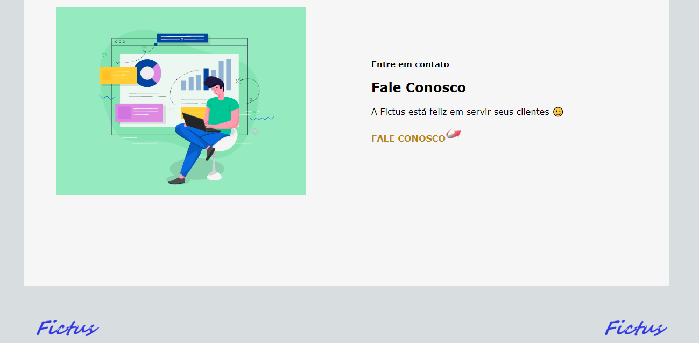

<h1 style="text-align: center;">Projeto da disciplina de Gerência de Configurações e Mudanças</h1>
<h2>Proposta do projeto: desenvolver site (páginas: Principal, Contato e Portfólio)</h2>
<h2>Conceito: empresa de software fictícia</h2>
<h2>Efeito didático: versionamento de código em equipe (usando o Git)</h2>
<h4 style="text-align: center;">Visite nossa página em Github Pages: 👇</h4>
<a href="https://atilaprog10.github.io/projeto-git/"></img></a>
<h2>Equipe (Desenvolvedores):</h2>
<ul>
  <li><a href="https://github.com/atilaprog10">Átylla Brasil</a></li>
  <li><a href="https://github.com/Brscabral">Bruno Severo</a></li>
</ul>
<h2>Tecnologias e ferramentas:</h2>

<h2>Técnicas usadas no desenvolvimento do site:</h2>
<ul>
  <li>Flexbox</li>
  <li>Container</li>
  <li>Pseudoclasse</li>
</ul>
<h2>Comandos GIT mais usados no versionamento:</h2>
<ul>
  <li>git status</li>
  <li>git branch</li>
  <li>git ckeckout nome_da_branch</li>
  <li>git add nome_do_arquivo </li>
  <li>git commit -m mensagem_entre_aspas_duplas</li>
  <li>git pull</li>
  <li>git push</li>
  <li>git merge nome_da_branch</li>
  <li>git log --oneline</li>
  <li>git reset --hard hash_do_log</li>
</ul>